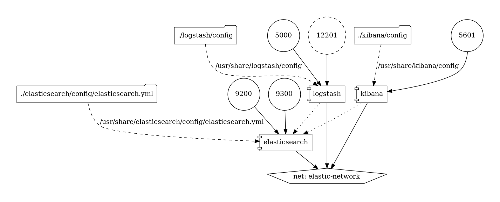

# Elastic Logging Stack

 

Run the latest version of the Elastic (previously known as ELK) stack with Docker and Docker Compose.

Based on the official Docker images from [Elastic](https://www.docker.elastic.co).

**Note**: Inbuilt [X-Pack support](https://www.elastic.co/products/x-pack) will give us the ability to analyze any data set by using the searching/aggregation capabilities of Elasticsearch and the visualization power of Kibana.


## Contents

1. [Requirements](#requirements)
2. [Getting started](#getting-started)
    * [Bringing up the stack](#bringing-up-the-stack)
    * [Log Entry](#log-entry)
        * [Via TCP](#via-tcp)
        * [Via UDP](#via-udp)
        * [Via File](#via-file)
        * [Via elasticsearch rest API](#via-elasticsearch-rest-api)
    * [Initial setup](#initial-setup)
        * [Default Kibana index pattern creation](#default-kibana-index-pattern-creation)
            * [Via the Kibana web UI](#via-the-kibana-web-ui)
            * [On the command line](#on-the-command-line)
    * [Exposed ports](#exposed-ports)
    * [Exposed volumes](#exposed-volumes)
3. [Configuration](#configuration)
    * [How can I tune the Kibana configuration?](#how-can-i-tune-the-kibana-configuration)
    * [How can I tune the Logstash configuration?](#how-can-i-tune-the-logstash-configuration)
    * [How can I tune the Elasticsearch configuration?](#how-can-i-tune-the-elasticsearch-configuration)
    * [How can I scale out the Elasticsearch cluster?](#how-can-i-scale-out-the-elasticsearch-cluster)
4. [Storage](#storage)
    * [How can I persist Elasticsearch data?](#how-can-i-persist-elasticsearch-data)
5. [Extensibility](#extensibility)
    * [How can I add plugins?](#how-can-i-add-plugins)
    * [How can I enable the provided extensions?](#how-can-i-enable-the-provided-extensions)
6. [JVM tuning](#jvm-tuning)
    * [How can I specify the amount of memory used by a service?](#how-can-i-specify-the-amount-of-memory-used-by-a-service)
7. [Useful Commands](#useful-commands)
    * [Start all containers](#start-all-containers)
    * [View running containers](#view-running-containers)
    * [Connect into command line of running container](#connect-into-command-line-of-running-container)
    * [Start-stop-restart specific service](#start-stop-restart-specific-service)
    * [View docker logs](#view-docker-logs)
    * [View docker logs for a particular service](#view-docker-logs-for-a-particular-service)
    * [Stop containers](#stop-containers)

8. [Further Studies](#further-studies)  

9. [Known Issues](#known-issues)  

10. [Updating to a newer Elastic version](#updating-to-a-newer-elastic-version)

## Requirements

1. [Docker](https://www.docker.com/community-edition#/download) version **1.10.0+**
2. [Docker Compose](https://docs.docker.com/compose/install/) version **1.6.0+**
3. Clone this repository

## Getting started

### Bringing up the stack

Start the elastic-docker stack using `docker-compose` and run it in background (detached mode):

```console
$ docker-compose up -d
```

Give Kibana a few seconds to initialize, then access the Kibana web UI by hitting
[http://localhost:5601](http://localhost:5601) with a web browser and use the following default credentials to login
* user: *elastic*
* password: *changeme*

**NOTE** For development purposes we have temporarily disabled the user authentiation of the stack provided by x-pack [here](elasticsearch/config/elasticsearch.yml#L19).


Refer to the Elastic documentation for a list of built-in users: [Setting Up User
Authentication](https://www.elastic.co/guide/en/x-pack/current/setting-up-authentication.html#built-in-users)

### Log entry
Now that the stack is running, we will want to inject some log entries. 

#### Via TCP
The shipped Logstash configuration allows us to send content via TCP to port `5000`.

As soon as we start putting some random logs to this port through `netcat` they get logged with index `tcp-logs`.

We can use the below command to send sample data via TCP to the stack: 
```console
echo '{"version": "1.1","host":"example.org","short_message":"A short message that helps you identify what is going on","full_message":"Backtrace here\n\nmore stuff","level":1,"_user_id":9001,"_some_info":"foo","_some_env_var":"bar"}' | nc -w 1 127.0.0.1 5000
```
If we brwose to [kibana Create index pattern page](http://localhost:5601/app/kibana#/management/kibana/index) we can see the `tcp-logs` index in available indices. 

#### Via UDP
We have port 12201 configured to accept logs via UDP. The logs sent to this port will be indexed as `udp-logs` automatically. 

We can use the below command to send sample data via UDP to the stack: 
```console
echo '{"version": "1.1","host":"example.org","short_message":"A short message that helps you identify what is going on","full_message":"Backtrace here\n\nmore stuff","level":1,"_user_id":9001,"_some_info":"foo","_some_env_var":"bar"}' | nc -u -w 1 127.0.0.1 12201
```
If we brwose to [kibana Create index pattern page](http://localhost:5601/app/kibana#/management/kibana/index) we can see the `udp-logs` index in available indices. 


#### Via file
The logstash service is loading file logs from `/usr/share/logstash/logs` directory of the logstash service container and indexing them with `application-logs`. 

Get into the logstash container shell using [this command](#connect-into-command-line-of-running-container) and put sample symfony `dev.log` and `prod.log` files into `/usr/share/logstash/logs` directory.

If we brwose to [kibana Create index pattern page](http://localhost:5601/app/kibana#/management/kibana/index) we can see the `application-logs` index in available indices. 

**NOTE:** We are using grok filter plugin in [logstash/pipeline/logstash-file.conf](logstash/pipeline/logstash-file.conf#L14) to understand symfony logs pattern and make sense out of it when we see them in kibana. 
#### Via elasticsearch rest API
Still in testing. Coming soon ...

## Initial setup

### Default Kibana index pattern creation

When Kibana launches for the first time, it is not configured with any index pattern. We need to inject data into Logstash before being able to configure a Logstash index pattern. The created pattern will automatically be marked as the default index pattern as soon as the Kibana UI is opened for the first time.

#### Via the Kibana web UI

[Connect Kibana with Elasticsearch](https://www.elastic.co/guide/en/kibana/current/connect-to-elasticsearch.html) has detailed instructions about the index pattern configuration.

#### On the command line
Still in testing. Coming soon ...

### Exposed ports
By default, the stack exposes the following ports:


| Port #|Used By Service| For
|------:|---------------|------------
| 5000  | logstash      |TCP input       
| 12201 | logstash      |UDP input       
| 9200  | elasticsearch |HTTP       
| 9300  | elasticsearch |TCP transport       
| 5601  | kibana        |HTTP       

### Exposed volumes
By default, the stack creates the following volumes:


| Volume                                            |Used By Service| For Storing
|---------------------------------------------------|---------------|------
| /usr/share/elasticsearch/config/elasticsearch.yml | elasticsearch | [conf](elasticsearch/config/elasticsearch.yml)       
| /usr/share/logstash/config/logstash.yml           | logstash      | [conf](logstash/config/logstash.yml)       
| /usr/share/logstash/pipeline                      | logstash      | [pipelines](logstash/pipeline)       
| /usr/share/logstash/patterns                      | logstash      | [patterns](logstash/patterns)
| /usr/share/kibana/config/kibana.yml               | kibana        | [conf](kibana/config/kibana.yml)  

## Configuration

**NOTE**: Configuration is not dynamically reloaded, we will have to restart the stack after any change in the configuration of a component.

### How can I tune the Kibana configuration?

The Kibana default configuration is stored in `kibana/config/kibana.yml`.

It is also possible to map the entire `config` directory instead of a single file.

### How can I tune the Logstash configuration?

The Logstash configuration is stored in `logstash/config/logstash.yml`.

It is also possible to map the entire `config` directory instead of a single file, however we must be aware that
Logstash will be expecting a
[`log4j2.properties`](https://github.com/elastic/logstash-docker/tree/master/build/logstash/config) file for its own
logging.

### How can I tune the Elasticsearch configuration?

The Elasticsearch configuration is stored in `elasticsearch/config/elasticsearch.yml`.

We can also specify the options we want to override directly via environment variables:

```yml
elasticsearch:

  environment:
    network.host: "_non_loopback_"
    cluster.name: "my-cluster"
```

### How can I scale out the Elasticsearch cluster?

[Scaling out Elasticsearch](https://github.com/deviantony/docker-elk/wiki/Elasticsearch-cluster)

## Storage

### How can I persist Elasticsearch data?

The data stored in Elasticsearch will be persisted after container reboot but not after container removal.

In order to persist Elasticsearch data even after removing the Elasticsearch container, we will have to mount a volume on
our Docker host. Update the `elasticsearch` service declaration to:

```yml
elasticsearch:

  volumes:
    - /path/to/storage:/usr/share/elasticsearch/data
```

This will store Elasticsearch data inside `/path/to/storage`.

**NOTE:** beware of these OS-specific considerations:
* **Linux:** the [unprivileged `elasticsearch` user][esuser] is used within the Elasticsearch image, therefore the
  mounted data directory must be owned by the uid `1000`.
* **macOS:** the default Docker for Mac configuration allows mounting files from `/Users/`, `/Volumes/`, `/private/`,
  and `/tmp` exclusively. Follow the instructions from the [documentation][macmounts] to add more locations.

[esuser]: https://github.com/elastic/elasticsearch-docker/blob/016bcc9db1dd97ecd0ff60c1290e7fa9142f8ddd/templates/Dockerfile.j2#L22
[macmounts]: https://docs.docker.com/docker-for-mac/osxfs/

## Extensibility

### How can I add plugins?

To add plugins to any Elastic component we have to:

1. Add a `RUN` statement to the corresponding `Dockerfile` (eg. `RUN logstash-plugin install logstash-filter-json`)
2. Add the associated plugin code configuration to the service configuration (eg. Logstash input/output)
3. Rebuild the images using the `docker-compose build` command

### How can I enable the provided extensions?

A few extensions are available inside the [`extensions`](extensions) directory. These extensions provide features which
are not part of the standard Elastic stack, but can be used to enrich it with extra integrations.

The documentation for these extensions is provided inside each individual subdirectory, on a per-extension basis. Some
of them require manual changes to the default Elastic configuration.

## JVM tuning

### How can I specify the amount of memory used by a service?

By default, both Elasticsearch and Logstash start with [1/4 of the total host
memory](https://docs.oracle.com/javase/8/docs/technotes/guides/vm/gctuning/parallel.html#default_heap_size) allocated to
the JVM Heap Size.

We can append extra JVM options to logstash and elsticsearch from the value of an environment variable, allowing the user to adjust the amount of memory that can be used by each component:

| Service       | Environment variable |
|---------------|----------------------|
| Elasticsearch | ES_JAVA_OPTS         |
| Logstash      | LS_JAVA_OPTS         |

To accomodate environments where memory is scarce (Docker for Mac has only 2 GB available by default), the Heap Size
allocation is capped by default to 256MB per service in the `docker-compose.yml` file. If we want to override the
default JVM configuration, we edit the matching environment variable(s) in the `docker-compose.yml` file.

For example, to increase the maximum JVM Heap Size for Logstash:

```yml
logstash:

  environment:
    LS_JAVA_OPTS: "-Xmx1g -Xms1g"
```
## Useful Commands
### Start all containers
```
 docker-compose up -d
```

### View running containers
```
 docker-compose ps
```
 
### Connect into command line of running container
```
docker-compose exec pr_elasticsearch sh
docker-compose exec pr_logstash sh
docker-compose exec pr_kibana sh
```
### Start-stop-restart specific service
```
docker-compose start <service_name>
docker-compose stop <service_name>
docker-compose restart <service_name>
```
### View docker logs
```
docker-compose logs
```
### View docker logs for a particular service
```
docker-compose logs -f <service_name>
```
 
### Stop containers
```
docker-compose down
```
 
## Further Studies
* [Kibana 5 Introduction](https://youtu.be/mMhnGjp8oOI)
* [Kibana/Elasticsearch Terms & Significant Terms](https://youtu.be/_CLLOeoK-ZY)
* [Kibana Aggregations Explained](https://youtu.be/j-eCKDhj-Os)
* [PHP application logging with Amazon CloudWatch Logs and Monolog](https://aws.amazon.com/blogs/developer/php-application-logging-with-amazon-cloudwatch-logs-and-monolog/)

## Known Issues 
* `No Gzip support:` We will have to uncompress the data before sending to logstash and we can keep an eye on issue [Add a general purpose gzip codec #1817](https://aws.amazon.com/blogs/developer/php-application-logging-with-amazon-cloudwatch-logs-and-monolog/) raised at logstash official repository. 

## Updating to a newer Elastic version

To use a different Elastic Stack version than the one currently available in the repository, simply change the version number inside the `.env` file and rebuild the stack with:

```console
docker-compose build
docker-compose up
```

**NOTE**: Always pay attention to the [upgrade instructions](https://www.elastic.co/guide/en/elasticsearch/reference/current/setup-upgrade.html) for each individual component before performing a stack upgrade.